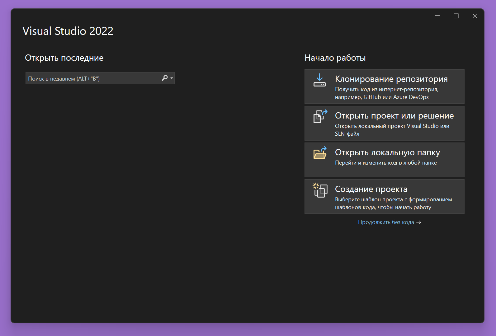

# Начало работы с EntityFramework

- [Начало работы с EntityFramework](#начало-работы-с-entityframework)
  - [Создание проекта](#создание-проекта)
  - [Установка пакетов](#установка-пакетов)
  - [Создание DbContext](#создание-dbcontext)
  - [Создание сущностей](#создание-сущностей)
  - [Создание DbSet'ов и БД](#создание-dbsetов-и-бд)
  - [Автоматическое добавление записей в БД](#автоматическое-добавление-записей-в-бд)


## Создание проекта


Выбираем "Создание проекта".


Удостоверяемся, что в (2) выставлен язык C#.
В поиске (1) пишем "wpf" и выбираем "Приложение WPF (Майкрософт)"(3).


Выбираем удобный путь для проекта.


Здесь нужно выбрать платформу .NET. Если вы не знаете, какую версию выбрать, и зачем это всё нужно, то, скорее всего, вам следует выбрать самую последнюю версию .NET с долгосрочной поддержкой. На момент написания этого текста, это .NET 8.0.


Должно появиться следующее окно.

Отлично, мы создали проект WPF.

## Установка пакетов

Чтобы работать с EntityFramework, нам сначала нужно его скачать и подключить. Для этого используется менеджер пакетов NuGet.


Нажимаем правой кнопкой мыши по проекту и выбираем "Управление пакетами NuGet".


Переходим во вкладку "Обзор" (1) и вписываем в поиск (2) "entityframeworkcore.sqlite". Нам нужно найти в списке `Microsoft.EntityFrameworkCore.Sqlite` (3). Выбираем его и в правом окне нажимаем "Установить" (4). Менеджер пакетов NuGet автоматически доустановит зависимые пакеты.

## Создание DbContext


Нажимаем правой кнопкой мыши по проекту и создаем новую папку. Назовем её "Data". Там будет находиться наш класс ApplicationContext, который мы будем использовать для работы с БД.


Нажимаем правой кнопкой мыши по папке "Data". Добавить -> Создать элемент...


Выбираем "Класс" (1) и называем его "ApplicationContext.cs" (2). Далее, нажимаем "Добавить".

```C#
namespace Project.Data
{
    internal class ApplicationContext
    {

    }
}
```
Мы получили такой файл.

Нам необходимо унаследовать `ApplicationContext` от `DbContext` (из EntityFramework) и сделать его публичным:
```C#
public class ApplicationContext : DbContext
```

Visual Studio автоматически создаст необходимый using:
```C#
using Microsoft.EntityFrameworkCore;
```

Далее, нам необходимо переопределить метод `OnConfiguring()`. Напишем следующее:
```C#
protected override void OnConfiguring(DbContextOptionsBuilder optionsBuilder)
{
}
```
Этот метод будет вызываться тогда, когда создается экземпляр `DbContext`. Мы будем использовать `DbContextOptionsBuilder`, который передается в этот метод для того, чтобы указать, с какой БД мы будем работать.

Вот пример:
```C#
optionsBuilder.UseSqlite("Data Source=<Название_БД>.db");
```
Строка, которая передается в `UseSqlite()` - это строка подключения. В данном примере мы просто говорим `DbContext`, чтобы он работал с указанным .db файлом.

Если мы хотим использовать SqlServer, а не Sqlite, тогда нам нужно установить пакет `Microsoft.EntityFrameworkCore.SqlServer` заместо `Microsoft.EntityFrameworkCore.Sqlite` и заменить строку подключения на такую:
```C#
optionsBuilder.UseSqlServer("Server=<Название_Сервера>;Database=<Название_БД>;Trusted_Connection=True;TrustServerCertificate=True;");
```
И в целом, больше никаких различий между взаимодействиями с БД Sqlite и SqlServer в коде не будет.

Здесь мы будем использовать Sqlite. БД будет называться "Database". Поэтому, строка подключения будет выглядеть так:
```C#
optionsBuilder.UseSqlite("Data Source=Database.db");
```
Название было выбрано произвольно, т.к. мы ещё не создали БД.

## Создание сущностей

Предположим, что у нас есть ТЗ. Вот фрагмент из него:


По этому ТЗ, нам нужно создать следующие сущности (атрибуты для клиента и мастера не прописаны в ТЗ, так же как и типы данных, поэтому придумаем/подберем их сами):
1. Заявка
    - Id (первичный ключ)
    - Номер заявки (int)
    - Дата добавления (DateOnly)
    - Вид авто (enum)
    - Модель авто (string)
    - Описание проблемы (string)
    - Клиент (int, внешний ключ)
    - Мастер (int, внешний ключ)
    - Статус заявки (enum)
2. Клиент
    - Id (первичный ключ)
    - Фамилия (string)
    - Имя (string)
    - Отчество (string)
    - Номер телефона (string)
3. Мастер
    - Id (первичный ключ)
    - Фамилия (string)
    - Имя (string)
    - Отчество (string)
    - Номер телефона (string)
    - Дата устройства на работу (DateOnly)


Мы будем описывать эти сущности в отдельных классах. Для удобства поместим их в одну папку. Например, в папку "Model":


Сначала создадим класс для сущности Клиент - `Client.cs`. Класс создается по аналогии с тем, как мы создавали `ApplicationContext.cs`.

Сразу же делаем класс публичным:
```C#
public class Client
```

Атрибуты сущности должны быть **публичными свойствами**. Будем создавать атрибуты по порядку. Сначала идет первичный ключ - `Id`. В качестве типа первичного ключа, мы можем выбрать int, string, guid и т.д. Но обычно используют int. В таком случае назначение id для записи будет происходить автоматически. В каждой новой записи id будет увеличиваться на 1. В БД при этом для первичного ключа пропишется `IDENTITY(1,1)`.

Чтобы создать первичный ключ, мы можем написать это:
```C#
public int Id { get; set; }
```
Либо это:
```C#
public int ClientId { get; set; }
```
Свойство станет первичным ключом в том случае, если оно называется "Id" либо "<Название_Сущности>Id".
Но если по какой-то причине мы не можем создать свойство с такими названиями, мы можем использовать атрибут `[Key]`. Например вот так:

```C#
[Key]
public int SomeUnnecessarilyLongNameOfAPrimaryKey { get; set; }
```

Создадим оставшиеся атрибуты:
```C#
public string LastName { get; set; }
public string FirstName { get; set; }
public string Patronymic { get; set; }
public string Phone { get; set; }
```

В итоге, класс Client должен выглядеть следующим образом:
```C#
public class Client
{
    public int Id { get; set; }
    public string LastName { get; set; }
    public string FirstName { get; set; }
    public string Patronymic { get; set; }
    public string Phone { get; set; }
}
```

По аналогии создадим класс для сущности Мастер - `Master.cs`:

```C#
public class Master
{
    public int Id { get; set; }
    public string LastName { get; set; }
    public string FirstName { get; set; }
    public string Patronymic { get; set; }
    public string Phone { get; set; }
    public DateOnly DateOfEmployment { get; set; }
}
```

С сущностью заявки немного сложнее. Там используются enum'ы и внешние ключи (foreign key), которые ссылаются на клиентов и мастеров.

Создадим `Request.cs`.

Для начала пропишем простые атрибуты:
```C#
public int Id { get; set; }
public int RequestNum { get; set; }
public DateOnly DateOfCreation { get; set; }
public string CarModel { get; set; }
public string Problem { get; set; }
```

Осталось добавить свойства для типа машины, статуса заявки, клиента и ответственного мастера.
Начнем с типа машины. Мы решили, что это будет enum. Enum'ы обычно прописываются прямо в namespace'ах, а не в классах. Для удобства создадим новую папку в папке `Model` - `Enums`. И также создадим там `CarType.cs`. 


Удаляем класс в этом файле, оставляем только namespace, и создаем enum для типов машин.
Должно получиться следующее:
```C#
namespace Project.Model.Enums
{
    public enum CarType
    {
        MICRO,
        SEDAN,
        CUV,
        SUV,
        HATCHBACK,
        MINIVAN,
        CABRIOLET,
        COUPE,
        ROADSTER,
        SUPERCAR,
        PICKUP,
        VAN,
        LIMOUSINE,
        CAMPERVAN,
        TRUCK
    }
}
```

По аналогии создадим `RequestStatus.cs` в папке `Enums`, и пропишем там enum для статусов заявок:
```C#
namespace Project.Model.Enums
{
    public enum RequestStatus
    {
        CREATED,
        IN_PROGRESS,
        FINISHED
    }
}
```

Теперь можно возвращаться к `Request.cs`.
Пропишем свойства для типа машины и статуса заявки:
```C#
public CarType CarType { get; set; }
public RequestStatus RequestStatus { get; set; }
```
Visual Studio должна сама добавить необходимый using, если вы воспользовались автодополнением во время написания CarType или RequestStatus (типы). Если же она не сделала этого, можно установить курсор на CarType или RequestStatus (именно на типы, а не названия свойств) и нажать `Alt + Enter`. И в списке выбрать необходимый using. Либо можно вручную прописать в начале файла
```C#
using Project.Model.Enums;
```
Этот using может отличаться от вашего, потому что здесь проект называется просто `Project`.

Отлично, теперь осталось добавить свойства для клиента и ответственного мастера.

Делается это следующим образом:
```C#
public Client Client { get; set; }
public Master Master { get; set; }
```

Вот и все! Но следует рассказать о некоторых тонкостях и особенностях. Если мы потом заглянем в саму БД, то обнаружим там атрибуты ClientId и MasterId с целочисленным типом. На самом деле EntityFramework втайне от нас создает эти свойства. Именно они и являются внешними ключами. А то, что мы прописали выше, нужно чтобы можно было удобно работать с объектами из БД.

Мы можем прописать внешние ключи явно:
```C#
public int ClientId { get; set; }
public Client Client { get; set; }

public int MasterId { get; set; }
public Master Master { get; set; }
```
В БД ничего не поменяется, но теперь мы можем получать доступ к id клиента и мастера напрямую.

Если по какой-то причине нам нужно сделать другие названия для внешних ключей, мы можем воспользоваться атрибутом `[ForeignKey]`. В следующем примере для Client указан внешний ключ `FK_Client`, а для Master - `FK_Master`

```C#
public int FK_Client { get; set; }

[ForeignKey(nameof(FK_Client))]
public Client Client { get; set; }


public int FK_Master { get; set; }

[ForeignKey(nameof(FK_Master))]
public Master Master { get; set; }
```

Но пока что оставим простую реализацию:
```C#
public class Request
{
    public int Id { get; set; }
    public int RequestNum { get; set; }
    public DateOnly DateOfCreation { get; set; }
    public CarType CarType { get; set; }
    public string CarModel { get; set; }
    public string Problem { get; set; }
    public Client Client { get; set; }
    public Master Master { get; set; }
    public RequestStatus RequestStatus { get; set; }
}
```

Важно! Если мы попытаемся добавить новую запись в данную таблицу `Request` и не укажем, например, мастера, то получим ошибку `NOT NULL constraint failed`. По умолчанию все атрибуты делаются `NOT NULL`, то есть, они не могут быть NULL. Мы можем сделать из зануляемыми, если поставим `?` после названия типа.

Допустим, мы хотим, чтобы мастер назначался уже после создания заявки. То есть сразу после создания заявки он может быть null. Изменим строчку со свойством `Master`:
```C#
public Master? Master { get; set; }
```

Все, теперь мы не обязаны назначать мастера сразу же.

## Создание DbSet'ов и БД

Созданные нами сущности не будут включены в БД, пока мы не создадим `DbSet`'ы в `DbContext`.

Перейдем в `ApplicationContext.cs` и пропишем там:
```C#
public DbSet<Client> Clients { get; set; }
public DbSet<Master> Masters { get; set; }
public DbSet<Request> Requests { get; set; }
```

Но и это ещё не все. Чтобы БД создалась, нужно вызвать `EnsureCreated()`. Эта функция проверяет, создана ли БД, которую мы указали в строке подключения (в нашем случае это `Database.db`). Если БД создана, функция возвращает false. Если БД ещё не создана, она создается, и функция возвращает true.

Мы можем поместить вызов этой функции в конструктор `ApplicationContext`:
```C#
public ApplicationContext()
{
    Database.EnsureCreated();
}
```

Осталось только вызвать этот конструктор где-нибудь.
Перейдем в `MainWindow.xaml`, нажмем `F7`, чтобы перейти к `MainWindow.xaml.cs`
Создадим приватное поле `ApplicationContext _context` и вызовем конструктор `ApplicationContext` в конструкторе этого окна - `MainWindow()`:
```C#
private ApplicationContext _context;
public MainWindow()
{
    InitializeComponent();
    _context = new ApplicationContext();
}
```

Теперь мы можем запустить приложение.

В `<Путь_До_Проекта>/bin/Debug/net<Версия_.NET>-windows/` появится БД:


> Можно использовать сайт [SQLite Viewer](https://inloop.github.io/sqlite-viewer/) для того, чтобы проверить, что с БД все в порядке.

## Автоматическое добавление записей в БД

Нам может понадобиться вносить какие-либо данные в БД при её создании, чтобы, например, ускорить процесс тестирования работы приложения.

Для этого мы можем создать листы с данными для внесения в БД и добавить их при помощи `AddRange()`.

Создадим несколько клиентов и мастеров:
```C#
private List<Client> _clients = new()
{
    new() { FirstName = "АБ", LastName = "ВГ", Patronymic = "ДЕ", Phone = "+73912334939"},
    new() { FirstName = "11", LastName = "22", Patronymic = "33", Phone = "+79373471290"}
};

private List<Master> _masters = new()
{
    new() { FirstName = "Уошщ", LastName = "Ууащ", Patronymic = "Бупщшо", Phone = "+73592945029", DateOfEmployment = DateOnly.Parse("20.10.2009")},
    new() { FirstName = "()", LastName = "<>", Patronymic = "[]", Phone = "+74832540698",  DateOfEmployment = DateOnly.Parse("21.02.2012")}
};
```

И пропишем в конструкторе `ApplicationContext()`:
```C#
if (Database.EnsureCreated() == true) // Если БД не была создана
{
    Clients.AddRange(_clients);
    Masters.AddRange(_masters);
    SaveChanges();
}
```

После всех добавлений, удалений и изменений необходимо прописывать `SaveChanges()`, иначе эти изменения не перенесутся в БД.

Если мы удалим `Database.db` и запустим приложение, то 2 клиента и 2 мастера добавятся в БД сразу же после её создания.