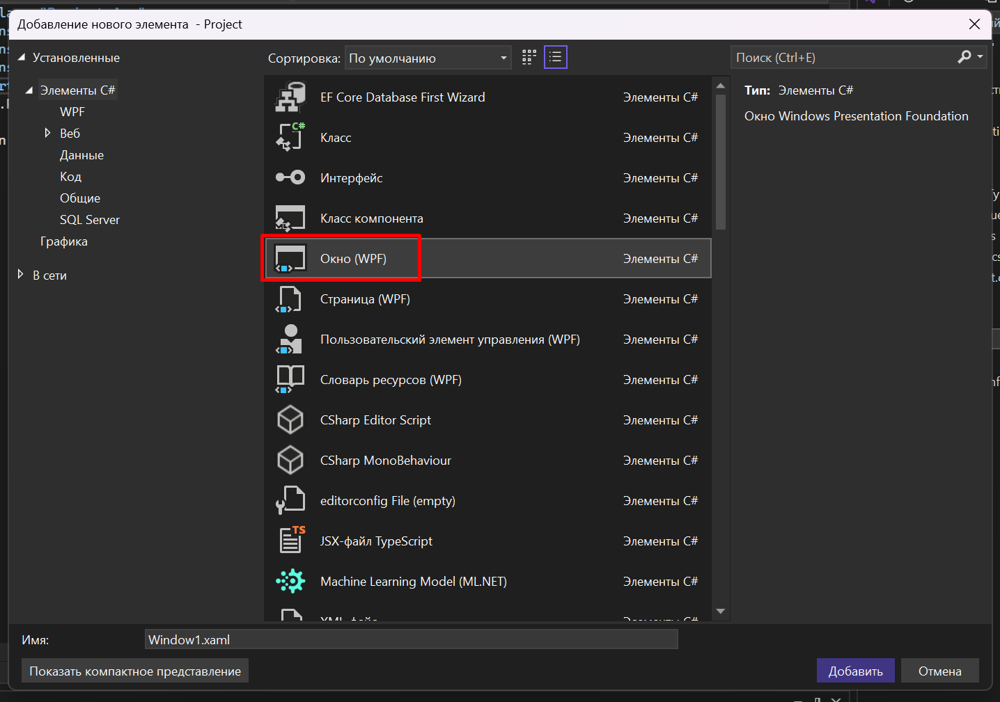

# Регистрация / Авторизация

- [Регистрация / Авторизация](#регистрация--авторизация)
  - [Создание сущностей](#создание-сущностей)
  - [Создание окон](#создание-окон)
  - [Авторизация](#авторизация)
  - [Регистрация](#регистрация)


## Создание сущностей

Воспользуемся проектом из `Начало работы с EntityFramework`, в котором мы создали `ApplicationContext.cs`, и некоторые сущности в папке `Model`.

Создадим сущность пользователя - `User`. В нем должны быть атрибуты, при помощи которых мы будем проводить авторизацию, например `Логин` и `Пароль`. Для этого, нам нужно создать класс `User.cs` в папке `Model`.

Делаем класс публичным:
```C#
public class User
```

Создаем свойства:
```C#
public int Id { get; set; }
public string Login { get; set; }
public string Password { get; set; }
```

Также у пользователя должна быть роль. Роль определяет, какой функционал приложения доступен для пользователя.
Создаем класс `Role.cs` в папке `Model`. Делаем его публичным и создаем необходимые свойства:
```C#
public class Role
{
    public int Id { get; set; }
    public string Name { get; set; }
}
```

И поместим свойство в `User`:
```C#
public Role Role { get; set; }
```

Теперь нам нужно создать `DbSet`'ы для этих сущностей в `ApplicationContext`:
```C#
public DbSet<User> Users { get; set; }
public DbSet<Role> Roles { get; set; }
```

Пусть будет 2 роли: "Пользователь" и "Админ".
Создадим `List` с этими ролями:

```C#
private List<Role> _roles = new()
{
    new() { Name = "Пользователь"},
    new() { Name = "Админ"}
};
```

И добавим `Roles.AddRange(_roles)` в конструктор `ApplicationContext()` внутрь тела `if (Database.EnsureCreated() == true)`.
В результате, конструктор должен выглядеть следующим образом:
```C#
public ApplicationContext()
{
    if (Database.EnsureCreated() == true) // Если БД не была создана
    {
        Clients.AddRange(_clients);
        Masters.AddRange(_masters);
        Roles.AddRange(_roles);
        SaveChanges();
    }
}
```

Теперь удалим `Database.db`, который находится в `<Путь_До_Проекта>/bin/Debug/net<Версия_.NET>-windows/`.

Если в `MainWindow.xaml.cs` есть вызов конструктора `ApplicationContext` (как мы делали в `Начало работы с EntityFramework`), то после запуска приложения `Database.EnsureCreated()` вернет true и у нас добавятся роли в `Roles`.

## Создание окон

Мы организуем .cs файлы по папкам для удобства. С окнами следует поступать так же. Создадим в проекте папку View. Переместим туда `MainWindow.xaml`.
Выбираем "Да" во всех диалоговых окнах, которые появляются в процессе. Однако, если мы сейчас запустим приложение, то получим необработанное исключение: `System.IO.IOException: "Cannot locate resource 'mainwindow.xaml'."`. То есть приложению не удалось найти окно, которое мы переместили в папку `View`.

Как приложение вообще понимает, какое окно является стартовым? Ответ: `App.xaml`. В корне проекта лежит этот файл. Если мы посмотрим в него, то обнаружим там `StartupUri="MainWindow.xaml"`. Это путь до стартового окна. Т.к. мы переместили его в папку `View`, то теперь его путь - `View/MainWindow.xaml`.
Заменим `MainWindow.xaml` на `View/MainWindow.xaml`, и теперь приложение будет запускаться.

Удалим `MainWindow.xaml` и создадим новое окно - окно авторизации. ПКМ по проекту -> `Добавить` -> `Создать элемент...`.


Выбираем `Окно (WPF)`. Называем его `AuthWindow.xaml` и меняем в `App.xaml` `View/MainWindow.xaml` на `View/AuthWindow.xaml`.

Откроем `AuthWindow.xaml`. В этом окне должны быть поля для ввода логина и пароля, а так же кнопки "Войти" и "Регистрация".

Для начала заменим `<Grid></Grid>` на `<StackPanel></StackPanel>`. Все элементы, которые помещаются в `StackPanel` автоматически располагаются друг за другом. По умолчанию это вертикальное расположение.

В этом `StackPanel` добавим свойства:
```html
HorizontalAlignment="Center" VerticalAlignment="Center"
```

То есть теперь `StackPanel` должен выглядеть так:
```html
<StackPanel HorizontalAlignment="Center" VerticalAlignment="Center">
</StackPanel>
```

Это нужно для того, чтобы все то, что мы будем добавлять в этот `StackPanel` располагалось по середине окна.

Поместим в `StackPanel` следующее:
```html
<StackPanel Orientation="Horizontal">
    <Label>Логин</Label>
    <TextBox Width="200"></TextBox>
</StackPanel>
```

Мы изменили ориентацию `StackPanel` при помощи `Orientation="Horizontal"`. Теперь элементы в нем будут располагаться друг за другом слева направо.
В нашем случае `TextBox` (поле ввода) будет стоять справа от `Label` "Логин" (просто текст). Для `TextBox` нужно задать ширину через свойство `Width`, потому если поместить `TextBox` в `StackPanel`, его ширина по умолчанию равняется 0.

Если запустить приложение, то мы увидим наши элементы, и что в текстовое поле можно вводить текст.

Сделаем то же самое, но для пароля.
Просто дублируем разметку и заменяем "Логин" на "Пароль":
```html
<StackPanel Orientation="Horizontal">
    <Label>Пароль</Label>
    <TextBox Width="200"></TextBox>
</StackPanel>
```

После этих двух `StackPanel` создадим 2 кнопки:
```html
<Button>Войти</Button>
<Button>Регистрация</Button>
```

Должно получиться следующее:
```html
<StackPanel HorizontalAlignment="Center" VerticalAlignment="Center">
    <StackPanel Orientation="Horizontal">
        <Label>Логин</Label>
        <TextBox Width="200"></TextBox>
    </StackPanel>

    <StackPanel Orientation="Horizontal">
        <Label>Пароль</Label>
        <TextBox Width="200"></TextBox>
    </StackPanel>

    <Button>Войти</Button>
    <Button>Регистрация</Button>
</StackPanel>
```

Теперь создадим окно регистрации - `RegistrationWindow.xaml`.

Можно перекопировать разметку из `AuthWindow.xaml` (но не копировать сам элемент `Window`, иначе все сломается). Оставим только одну кнопку и изменим её текст на "Зарегистрироваться". Добавим ещё один `<StackPanel>`, в котором сделаем `<Label>` с текстом "Роль" и рядом с ним `<ComboBox>` - выпадающее меню.

Должно получиться следующее:
```html
<StackPanel HorizontalAlignment="Center" VerticalAlignment="Center">
    <StackPanel Orientation="Horizontal">
        <Label>Логин</Label>
        <TextBox Width="200"></TextBox>
    </StackPanel>

    <StackPanel Orientation="Horizontal">
        <Label>Пароль</Label>
        <TextBox Width="200"></TextBox>
    </StackPanel>

    <StackPanel Orientation="Horizontal">
        <Label>Роль</Label>
        <ComboBox Width="200"></ComboBox>
    </StackPanel>

    <Button Click="SignUpButtonClick">Зарегистрироваться</Button>
</StackPanel>
```

Также создадим окно, которое будет открываться после авторизации. Пусть оно будет называться `MenuWindow.xaml`.

Пропишем там заместо `<Grid>`:
```C#
<StackPanel HorizontalAlignment="Center" VerticalAlignment="Center">
</StackPanel>
```
И пока хватит. Вернемся к нему позже.

Теперь у нас есть окна с текстовыми полями, куда можно вводить текст и кнопки, которые можно нажимать. Теперь нужно прописать логику для этого всего.

## Авторизация

Чтобы обращаться к элементам разметки из кода, нужно дать им имена. Например, дадим имя `TextBox`, в который вводится логин. Перейдем в `AuthWindow.xaml` и добавим к нему свойство `Name="loginTextBox"`. Поступим так же с полем ввода пароля - `Name="passwordTextBox"`.

Теперь поля должны выглядеть так:
```html
<StackPanel Orientation="Horizontal">
    <Label>Логин</Label>
    <TextBox Name="loginTextBox" Width="200"></TextBox>
</StackPanel>

<StackPanel Orientation="Horizontal">
    <Label>Пароль</Label>
    <TextBox Name="passwordTextBox" Width="200"></TextBox>
</StackPanel>
```

Для кнопок назначим обработчики событий:
```html
<Button Click="SignInButtonClick">Войти</Button>
<Button Click="SignUpButtonClick">Регистрация</Button>
```

Нажмем `F7`, чтобы попасть в `AuthWindow.xaml.cs`.

В классе `AuthWindow` пропишем:
```C#
private ApplicationContext _context = new ApplicationContext();
```

И создадим обработчики событий нажатий кнопок:
```C#
private void SignInButtonClick(object sender, RoutedEventArgs e)
{

}

private void SignUpButtonClick(object sender, RoutedEventArgs e)
{

}
```

`SignInButtonClick()` будет вызываться, когда мы нажимаем кнопку "Войти".

Чтобы получить доступ к тексту, который мы вводим в поля, воспользуемся свойством `Text`.

Для начала, сделаем проверку в `SignInButtonClick()`:
```C#
if (string.IsNullOrWhiteSpace(loginTextBox.Text) || string.IsNullOrWhiteSpace(passwordTextBox.Text))
{
    MessageBox.Show("Заполните все поля!");
    return;
}
```

Если хотя бы одно текстовое поле пустое или состоит только из пробелов, тогда мы показываем сообщение пользователю "Заполните все поля!" и выходим из метода `SignInButtonClick()`.

Код, расположенный после тела этой проверки, будет выполняться в том случае, если все поля заполнены корректно.

Напишем далее:
```C#
_context.Users.Load();
```
Таким образом мы подгружаем пользователей из БД. Так нужно делать всегда, когда мы собираемся работать с записями из таблиц БД.

Теперь нам нужно найти пользователя в БД с введенными в поля логином и паролем. Сделаем это при помощи LINQ:
```C#
User? user = _context.Users.ToList().FirstOrDefault(x => x.Login == loginTextBox.Text && x.Password == passwordTextBox.Text, null);
```

Здесь мы берем `DbSet` `Users`, преобразуем его в `List`, и пытаемся найти элемент, у которого `Login` равен `loginTextBox.Text` и `Password` равен `passwordTextBox.Text`. `FirstOrDefault()` возвращает первый попавшийся элемент, который удовлетворяет всем условиям. Через запятую мы указали `null`. Это то, что вернет `FirstOrDefault()`, если такой элемент не будет найден. Значит либо найденный `User`, либо `null` будут в результате записаны в `User? user`.

Сделаем проверку пользователя на `null`:
```C#
if (user == null)
{
    MessageBox.Show("Пользователь не найден!");
    return;
}
```

Если user не `null`, тогда мы успешно авторизовались, такой пользователь имеется, тело проверки не выполнится, метод продолжит выполнение. Далее нам нужно запомнить этого пользователя. Создадим в папке `Data` класс `AuthData.cs`.

Сделаем класс статичным:
```C#
internal static class AuthData
```

Добавим в него:
```C#
public static User? user;
```

Мы не сможем создавать экземпляры `AuthData` сохраненный пользователь может быть только один на все приложение.

Теперь вернемся к `AuthWindow.xaml.cs`. 

Напишем:
```C#
AuthData.user = user;
```

И откроем основное окно:
```C#
MenuWindow menuWindow = new MenuWindow();
menuWindow.ShowDialog();
```

В `MenuWindow.xaml` добавим:
```html
<Label Name="welcomeLabel"></Label>
```

Перейдем в `MenuWindow.xaml.cs`. Там добавим в конструктор `MenuWindow()`:
```C#
string welcomeString = "Привет, " + AuthData.user.Login + "!\n";

if (AuthData.user.Role.Name == "Пользователь")
{
    welcomeString += "Ваша роль - пользователь. Вам доступны функции X и Y.";
}
else if (AuthData.user.Role.Name == "Админ")
{
    welcomeString += "Ваша роль - админ. Вам доступны все функции.";
}

welcomeLabel.Content = welcomeString;
```

Здесь мы просто задаем текст `Label`, в который встраиваем логин пользователя, и далее пишем текст,который зависит от роли текущего пользователя.

Готово! Только мы не сможем авторизоваться прямо сейчас, потому что у нас нет ни одного пользователя. Сделаем регистрацию.

## Регистрация

Перейдем в `AuthWindow.xaml.cs`.
В `SignUpButtonClick()` напишем код для открытия окна регистрации:
```C#
RegistrationWindow registrationWindow = new RegistrationWindow(_context);
registrationWindow.ShowDialog();
```

Мы передаем в окно регистрации текущий ApplicationContext, чтобы можно было добавлять нового пользователя в БД и проверять, существует ли пользователь с введенным логином.

Перейдем в `RegistrationWindow.xaml`. Назначим обработчик событий для кнопки "Зарегистрироваться":
```html
<Button Click="SignUpButtonClick">Зарегистрироваться</Button>
```

И дадим имя `<ComboBox>`:
```html
<ComboBox Name="roleComboBox" Width="200"></ComboBox>
```

Ещё зададим свойство `DisplayMemberPath`, чтобы `<ComboBox>` знал, что является отображаемым названием у объектов, которые мы будем туда помещать. В нашем случае это "Name", потому что именно так мы назвали свойство в `Role`.
```html
<ComboBox Name="roleComboBox" DisplayMemberPath="Name" Width="200"></ComboBox>
```

Перейдем в `RegistrationWindow.xaml.cs`. Добавим `_context` и изменим конструктор:
```C#
private ApplicationContext _context;

public RegistrationWindow(ApplicationContext context)
{
    InitializeComponent();

    _context = context;
    _context.Roles.Load();
    roleComboBox.ItemsSource = _context.Roles.ToList();
    roleComboBox.SelectedIndex = 0;
}
```

Теперь при вызове конструктора в `_context` будет сохраняться `ApplicationContext`, который мы в него передаем. Ещё мы подгружаем роли и задаем `ItemSource` у `<ComboBox>`. Это необходимо для отображения наших ролей в `<ComboBox>`. После этого мы задаем `SelectedIndex`, чтобы сразу был выбран первый элемент в списке ролей.

В `SignUpButtonClick()` продублируем код из `SignInButtonClick()` из `AuthWindow.xaml.cs` за исключением строчек, где открывается окно:

```C#
private void SignUpButtonClick(object sender, RoutedEventArgs e)
{
    if (string.IsNullOrWhiteSpace(loginTextBox.Text) || string.IsNullOrWhiteSpace(passwordTextBox.Text))
    {
        MessageBox.Show("Заполните все поля!");
        return;
    }

    _context.Users.Load();

    User? user = _context.Users.ToList().FirstOrDefault(x => x.Login == loginTextBox.Text && x.Password == passwordTextBox.Text, null);

    if (user != null)
    {
        MessageBox.Show("Такой пользователь уже существует!");
        return;
    }
}
```

И ещё поменяем `FirstOrDefault()`:
```C#
FirstOrDefault(x => x.Login == loginTextBox.Text, null);
```
И поменяем проверку `if (user == null)` на `if (user != null)`, потому что теперь для нас нежелательной ситуацией является наличие пользователя с введенным логином.

Если пользователь с таким логином найден, выведется сообщение "Такой пользователь уже существует!".

Далее создадим пользователя:
```C#
User newUser = new User();
newUser.Login = loginTextBox.Text;
newUser.Password = passwordTextBox.Text;
newUser.Role = (Role)roleComboBox.SelectedItem;
```

И добавим его в БД:
```C#
_context.Add(newUser);
_context.SaveChanges();
```

Отображаем сообщение, что пользователь зарегистрирован и закрываем окно:
```C#
MessageBox.Show("Пользователь зарегистрирован!");

DialogResult = true;
Close();
```

`DialogResult` обычно задают, чтобы показать, что диалоговое окно успешно либо неуспешно завершило выполнение. В нашем случае мы выставляем `DialogResult` на true, чтобы показать, что пользователь был успешно зарегистрирован. Мы можем взять `DialogResult` через экземпляр окна в будущем. Однако сейчас, нам это не нужно, но всегда задавать `DialogResult` перед закрытием диалогового окна - хорошая практика, т.к. про это потом можно забыть.

Готово! Теперь можно запускать приложение и все должно работать. Можно создавать новых пользователей, указывать им роли и авторизовываться при помощи логина и пароля, которые были указаны при регистрации.

Логику приложения можно строить вокруг роли авторизованного пользователя (который лежит в `AuthData`), чтобы давать возможность определенной роли совершать какие-то действия, и при этом запрещая совершать другие действия.